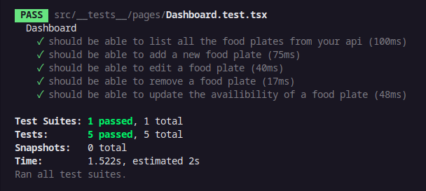
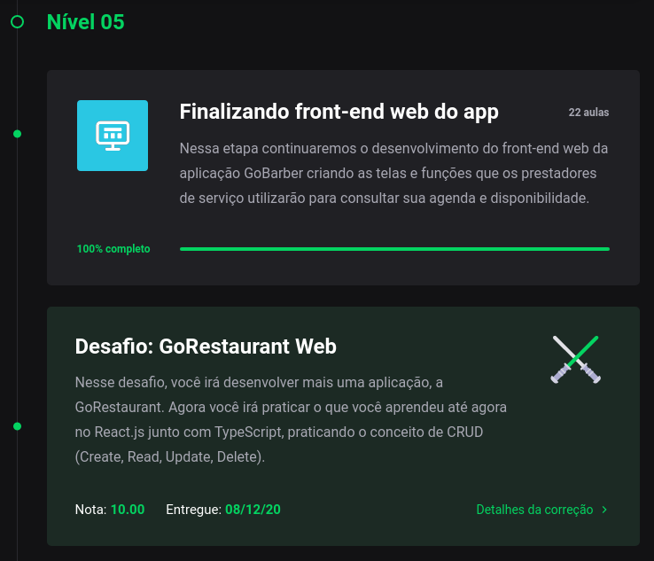

<h3 align="center">Bootcamp GoStack 13 - Desafio: GoRestaurant Web</h3>

Nesse desafio, devemos criar uma nova aplicação, a GoRestaurant, para praticar o que aprendemos até agora no React.js junto ao TypeScript, praticando o conceito de CRUD (Create, Read, Update, Delete)

Essa aplicação deve se conectar a uma fake API, e exibir os pratos de comidas criados além de permitir a criação, remoção e atualização desses pratos.

#### Para esse desafio temos os seguintes testes:

- should be able to list all the food plates from your api
- should be able to add a new food plate
- should be able to edit a food plate
- should be able to remove a food plate
- should be able to update the availibility of a food plate

## Clonar e Testar

`$ git clone https://github.com/Newton-Duarte/gostack-gorestaurant-web.git`

`$ cd gostack-gorestaurant-web`

`$ yarn` ou `$ npm install`

`$ yarn test` ou `$ npm run test`

